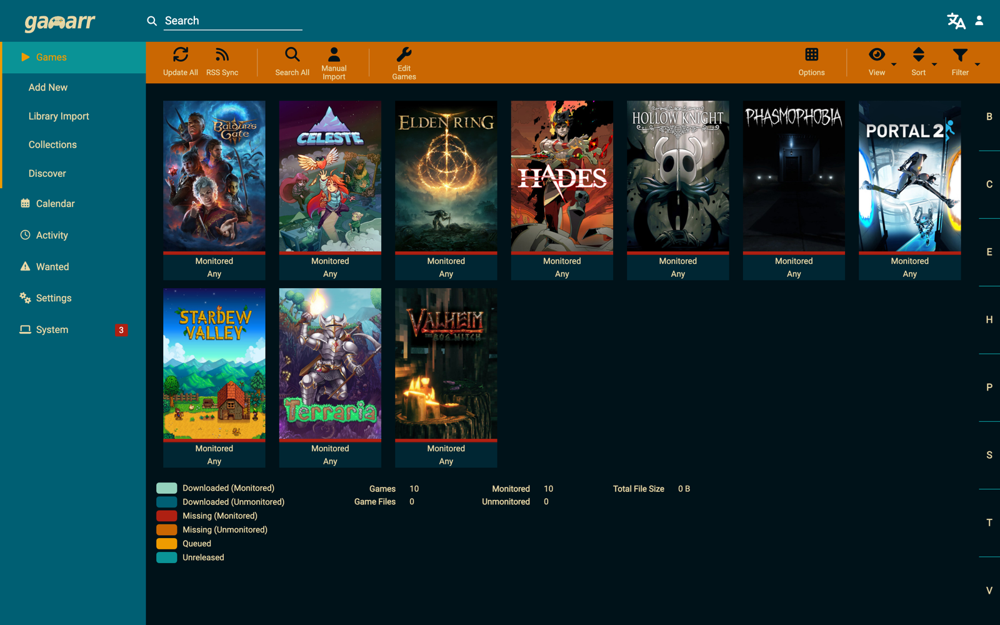
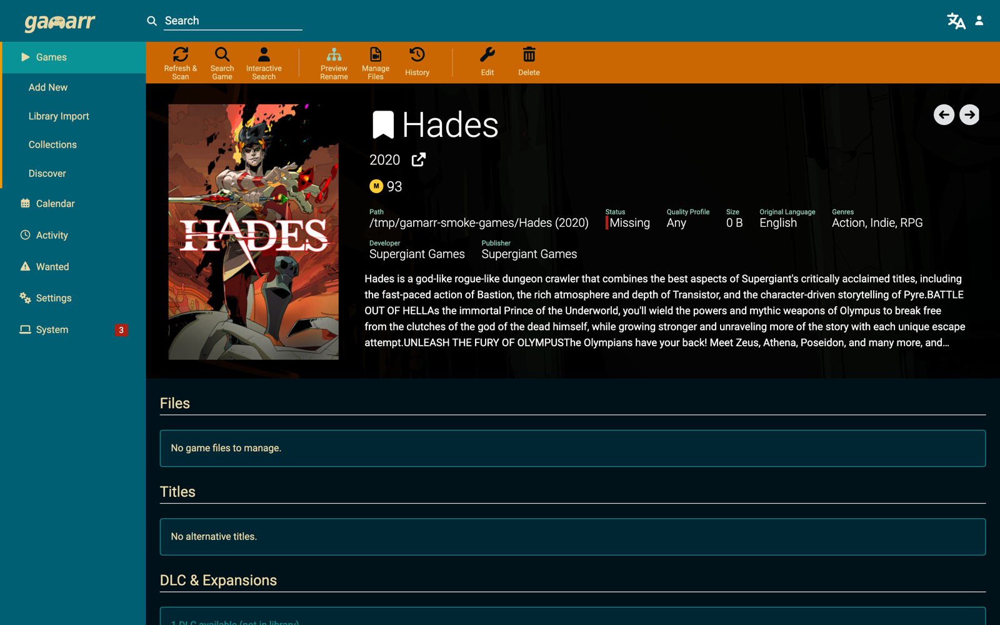
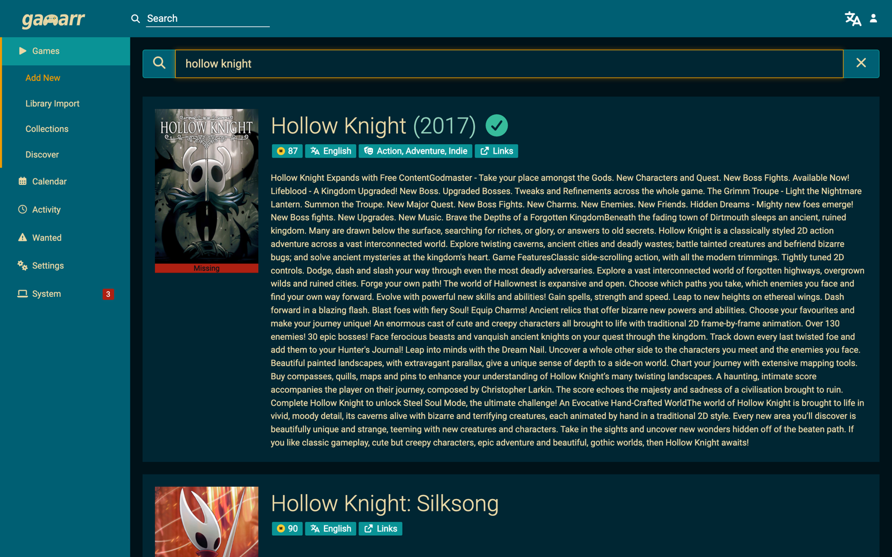
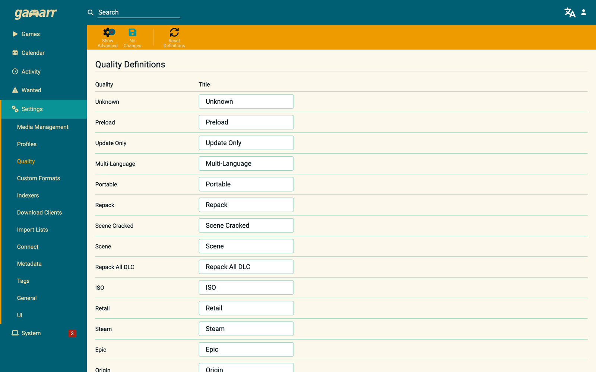

# Gamarr

[](https://github.com/gamarr-app/Gamarr/actions/workflows/ci.yml)
[](https://github.com/gamarr-app/Gamarr/pkgs/container/gamarr)
[](https://github.com/gamarr-app/Gamarr/releases)
[](http://www.gnu.org/licenses/gpl.html)

Gamarr is a game collection manager for Usenet and BitTorrent users — Radarr, but for your game library. It monitors RSS feeds and indexers for the games you want, hands grabs to your download client, and imports, renames, and organizes the results. Because games aren't movies, Gamarr also understands the things only games do: **it recognizes versions, updates, and DLC, and can automatically upgrade your library when a newer version or a more complete repack shows up.**

## Screenshots

| Library | Game details |
| --- | --- |
|  |  |

| Add a game | Game-native qualities |
| --- | --- |
|  |  |

## Getting Started

The easiest way to run Gamarr is Docker:

```yaml
services:
  gamarr:
    image: ghcr.io/gamarr-app/gamarr:latest
    container_name: gamarr
    environment:
      - PUID=1000
      - PGID=1000
      - TZ=Etc/UTC
    volumes:
      - ./gamarr-config:/config
      - /path/to/games:/games
      - /path/to/downloads:/downloads
    ports:
      - "6767:6767"
    restart: unless-stopped
```

Then open `http://localhost:6767`. A copy of this file ships as
[`docker-compose.example.yml`](docker-compose.example.yml). The image is also
mirrored to Docker Hub as [`gamarr/gamarr`](https://hub.docker.com/r/gamarr/gamarr)
(GHCR is the canonical source; it has no pull rate limits). Standalone builds
for Windows, Linux, macOS, and ARM (including Raspberry Pi) are on the
[releases page](https://github.com/gamarr-app/Gamarr/releases).

Point your indexers at Gamarr via [Prowlarr](https://github.com/Prowlarr/Prowlarr)
or Jackett using a Torznab feed with game categories (1000 = Console,
4000 = PC), add a download client, and add your first game.

## Major Features

* Game-native quality model: Scene, GOG (DRM-free), Repack, ISO, Retail, Portable — not video resolutions
* Recognizes game versions, updates, and DLC in release names; can upgrade when a newer version releases
* Steam library and Steam wishlist import lists — point Gamarr at your account and it monitors your backlog
* Game discovery: popular, trending, and recommendations based on your library
* Metadata from three sources — Steam (no key needed), IGDB, and RAWG — merged into one record
* Manual and automatic search, failed-download handling, and RSS sync, same as the rest of the *arr family
* Works with SABnzbd, NZBGet, qBittorrent, Deluge, rTorrent, Transmission, uTorrent, and more
* Optional virus scanning of imports via ClamAV, with quarantine
* Notifications: Discord, Telegram, Slack, Webhook, Apprise, Notifiarr, and ~20 others
* Renaming with game-aware tokens ({Game Title}, {Edition Tags}, {SteamAppId}, …)
* SQLite by default, PostgreSQL optional

## Metadata Sources

* **Steam** — primary source for PC games, no API key required
* **IGDB** — comprehensive game database with detailed metadata (free API credentials)
* **RAWG** — additional game data and recommendations (free API key)

## Support

Note: GitHub Issues are for Bugs and Feature Requests Only

[](https://github.com/gamarr-app/Gamarr/issues)

## Contributors & Developers

This project exists thanks to all the people who contribute.
- [Contribute (GitHub)](CONTRIBUTING.md)

### License

* [GNU GPL v3](http://www.gnu.org/licenses/gpl.html)
* Copyright 2010-2026
