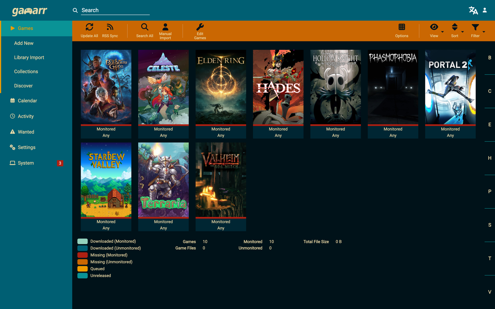
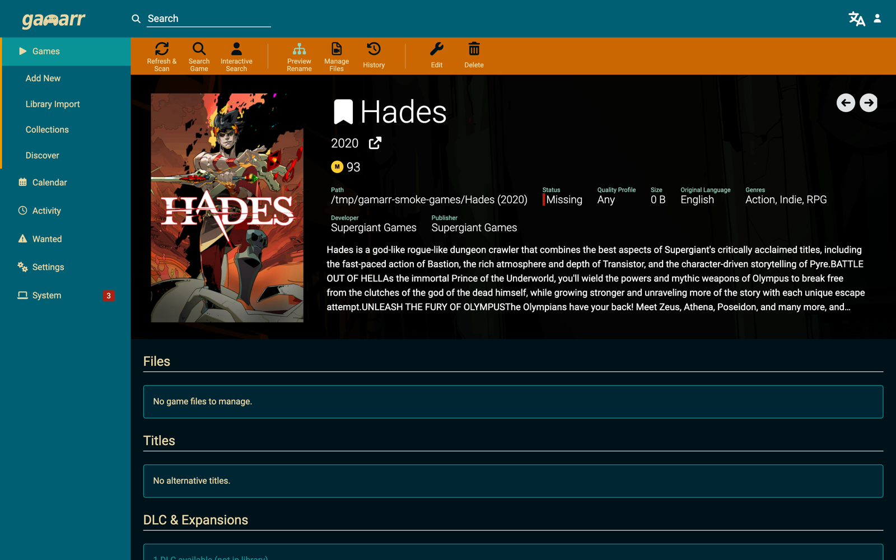
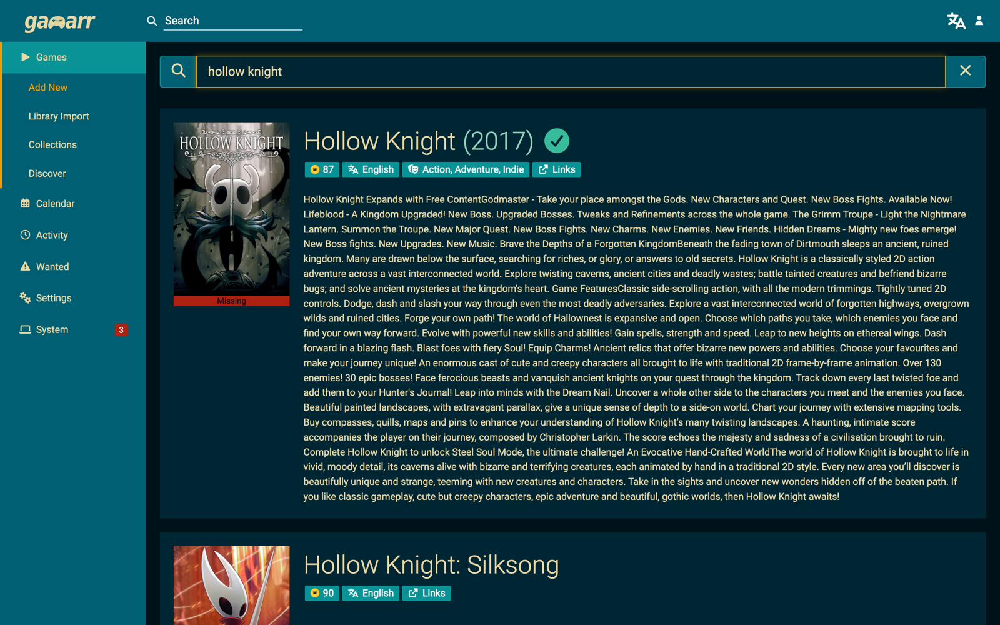
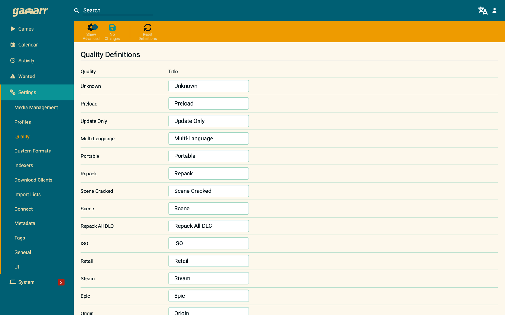

# Gamarr — a self-hosted PVR for your game library

[](https://github.com/gamarr-app/Gamarr/actions/workflows/ci.yml)
[](https://github.com/gamarr-app/Gamarr/pkgs/container/gamarr)
[](https://github.com/gamarr-app/Gamarr/releases)
[](http://www.gnu.org/licenses/gpl.html)

Gamarr is a self-hosted game collection manager and PVR for Usenet and BitTorrent
users — Radarr, but for your game library. It monitors RSS feeds and indexers for
the PC and console games you want, hands grabs to your download client, and
imports, renames, and organizes the results.

Because games aren't movies, Gamarr also understands the things only games do: it
recognizes versions, updates, and DLC, and can automatically upgrade your library
when a newer version or a more complete repack shows up.

## Screenshots

| Library | Game details |
| --- | --- |
|  |  |

| Add a game | Game-native qualities |
| --- | --- |
|  |  |

## Getting Started

The easiest way to run Gamarr is Docker:

```yaml
services:
  gamarr:
    image: ghcr.io/gamarr-app/gamarr:latest
    container_name: gamarr
    environment:
      - PUID=1000
      - PGID=1000
      - TZ=Etc/UTC
    volumes:
      - ./gamarr-config:/config
      - /path/to/games:/games
      - /path/to/downloads:/downloads
    ports:
      - "6767:6767"
    restart: unless-stopped
```

Open `http://localhost:6767`, then:

1. Add your indexers through [Prowlarr](https://github.com/Prowlarr/Prowlarr) or
   Jackett, as a Torznab feed with game categories (1000 = Console, 4000 = PC).
2. Add a download client.
3. Add your first game.

A copy of the compose file above ships as
[`docker-compose.example.yml`](docker-compose.example.yml). The image is also
mirrored to Docker Hub as [`gamarr/gamarr`](https://hub.docker.com/r/gamarr/gamarr),
though GHCR is the canonical source and has no pull rate limits. Standalone
builds for Windows, Linux, macOS, and ARM (including Raspberry Pi) are on the
[releases page](https://github.com/gamarr-app/Gamarr/releases).

## Major Features

* **Game-native quality model** — Scene, GOG (DRM-free), Repack, ISO, Retail, and
  Portable, instead of video resolutions
* **Version awareness** — recognizes game versions, updates, and DLC in release
  names, and can upgrade when a newer version releases
* **Game components** — base game, updates, and DLC are tracked as separate slots
  under one library entry. Updates import into `Updates/<version>/` alongside the
  base game instead of replacing it, DLC into `DLC/<name>/`. Every slot is
  individually monitorable and searchable from the Components panel, DLC slots
  come from Steam/IGDB metadata and can carry their own quality profile, and
  bundled releases (`game.iso` + `update_1.7/` + a known DLC folder) are split
  into their components at import
* **Update retention** — keep the newest N updates plus the newest of each major
  version, and send older ones to the recycle bin. Configurable, or keep
  everything
* **Multi-platform titles** — one library entry per platform, each with its own
  folder, profile, and platform-filtered searches. The poster index groups
  platform siblings into one card with per-platform status chips
* **Steam import lists** — point Gamarr at your account and it monitors your Steam
  library and wishlist
* **Discovery** — popular and trending games, plus recommendations based on your
  library
* **Three metadata sources** — Steam (no key needed), IGDB, and RAWG, merged into
  one record
* **The usual \*arr plumbing** — manual and automatic search, failed-download
  handling, and RSS sync
* **Download clients** — SABnzbd, NZBGet, qBittorrent, Deluge, rTorrent,
  Transmission, uTorrent, and more
* **Virus scanning** — optional ClamAV scan of imports, with quarantine
* **Notifications** — Discord, Telegram, Slack, Webhook, Apprise, Notifiarr, and
  ~20 others
* **Game-aware renaming** — tokens such as {Game Title}, {Edition Tags},
  {SteamAppId}
* **SQLite by default**, PostgreSQL optional

## Metadata Sources

* **Steam** — primary source for PC games, no API key required
* **IGDB** — comprehensive game database with detailed metadata (free API credentials)
* **RAWG** — additional game data and recommendations (free API key)

## Support

GitHub Issues are for bugs and feature requests only.

[](https://github.com/gamarr-app/Gamarr/issues)

## Contributors & Developers

This project exists thanks to all the people who contribute.
- [Contribute (GitHub)](CONTRIBUTING.md)

### License

* [GNU GPL v3](http://www.gnu.org/licenses/gpl.html)
* Copyright 2010-2026
